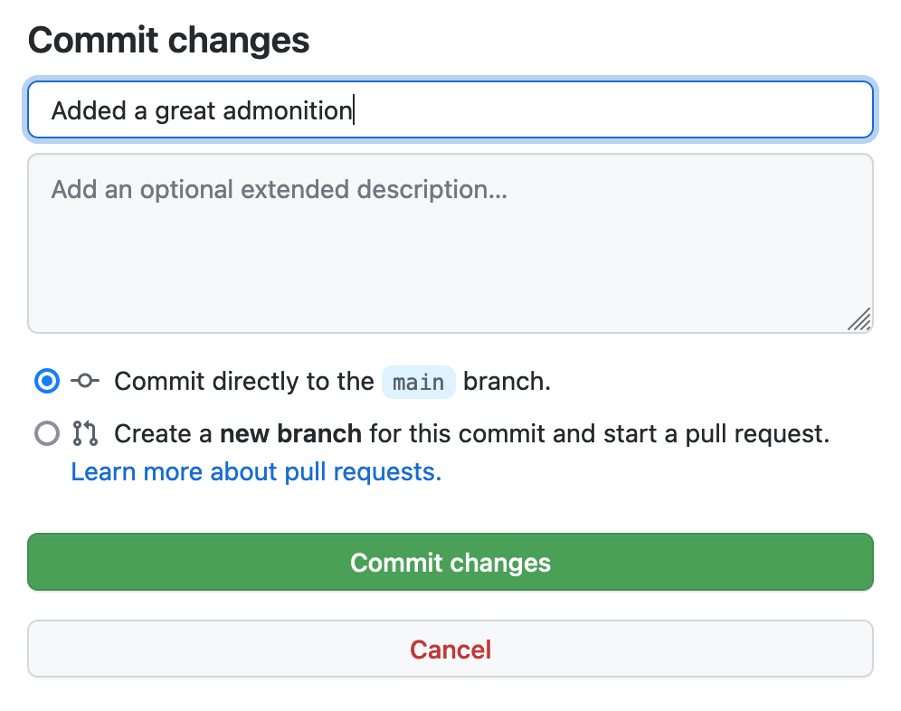

# FAIR-training-handbook

**Any issues?** Contact Geert van Geest (@GeertvanGeest)

## How to contribute (for non-git gurus)

First, you will need to be able to edit this repository. Ask for permissions at the repository admins (currently Geert van Geest). 

If you are authoring one of the chapters, the easy way to contribute would be to edit in the browser. Do this by:

- navigating to your chapter at `docs/chapters/` at the top of this page
- clicking on your chapter's md file (e.g. `chapter_10.md`)
- clicking on the **edit** buttion:

<figure>
  
</figure>

Now you can edit the markdown. Here is a tutorial on [markdown basics](https://docs.github.com/en/get-started/writing-on-github/getting-started-with-writing-and-formatting-on-github/basic-writing-and-formatting-syntax). For more advanced functionality, visit the [mkdocs material webpage](https://squidfunk.github.io/mkdocs-material/). For example for information on how to display [admonitions](https://squidfunk.github.io/mkdocs-material/reference/admonitions/). 

If you have finished, you can directly commit to main. In order to do that, write a commit message, and click the green button with **Commit changes**:

<figure>
  
</figure>

After commiting it will take ~30-60 seconds before the website is updated with your changes. The website is hosted at [https://elixir-fair-training.github.io/FAIR-training-handbook/](https://elixir-fair-training.github.io/FAIR-training-handbook/).

### Adding tables 

If you want to build large tables, have a look at [markdown tables generator](https://www.tablesgenerator.com/markdown_tables).

### Adding references

This website supports bibtex (pandoc style). In order to add a reference, add it in bibtex format to `references.bib`, cite it in your markdown document with `[@refid]` (for the ten simple rules paper this would be `[@Garcia2020]`), and at the bottom of the page add the line `\bibliography`. You can find an example in `docs/index.md`. 

## Aims

Building on the FAIR training handbook as outlined by the ELIXIR FAIR training group.

Please see the 10 simple rules for [FAIR training materials publication](https://journals.plos.org/ploscompbiol/article?id=10.1371/journal.pcbi.1007854). 

Please contact Geert van Geest if you want to contribute to this repo.

## If working locally

This website is generated with [MkDocs](https://www.mkdocs.org/), with the theme [Material](https://squidfunk.github.io/mkdocs-material/).

To host it locally, install MkDocs:
```bash
pip install mkdocs
```

and Material:
```bash
pip install mkdocs-material
```

Clone this repository to your local computer. Then, make the repository your current directory and type:

```bash
mkdocs serve
```

To host it locally.

Check it out with your browser at [http://localhost:8000/](http://localhost:8000/).

If you commit to the branch `main` (the default branch), the website will be automatically updated in 30-60 seconds.

This will generate a webpage at:

https://ELIXIR-FAIR-Training.github.io/FAIR-training-handbook
