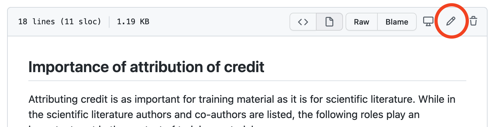
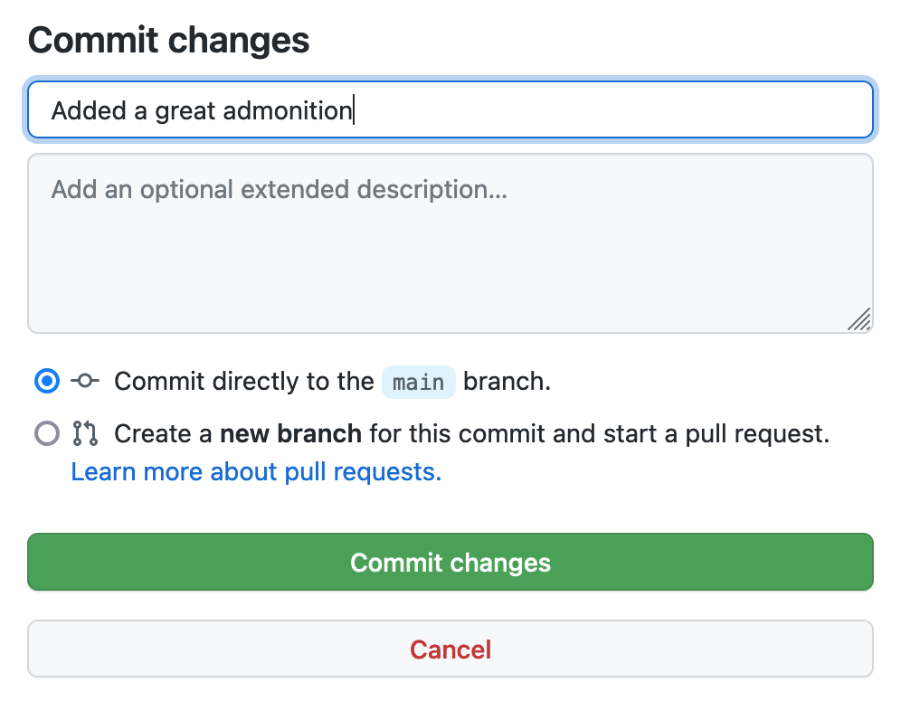

# FAIR-training-handbook


[](https://doi.org/10.5281/zenodo.8239503)

**Any issues?** Contact Geert van Geest (@GeertvanGeest)

## How to contribute (for non-git gurus)

First, you will need to be able to edit this repository. Ask for permissions at the repository admins (currently Geert van Geest). 

If you are authoring one of the chapters, the easy way to contribute would be to edit in the browser. Do this by:

- navigating to your chapter at `docs/chapters/` at the top of this page
- clicking on your chapter's md file (e.g. `chapter_10.md`)
- clicking on the **edit** buttion:

<figure>
  
</figure>

Now you can edit the markdown. Here is a tutorial on [markdown basics](https://docs.github.com/en/get-started/writing-on-github/getting-started-with-writing-and-formatting-on-github/basic-writing-and-formatting-syntax). For more advanced functionality, visit the [mkdocs material webpage](https://squidfunk.github.io/mkdocs-material/). For example for information on how to display [admonitions](https://squidfunk.github.io/mkdocs-material/reference/admonitions/). 

If you have finished, you can directly commit to main. In order to do that, write a commit message, and click the green button with **Commit changes**:

<figure>
  
</figure>

After commiting it will take ~30-60 seconds before the website is updated with your changes. The website is hosted at 
[https://elixir-europe-training.github.io/ELIXIR-TrP-FAIR-training-handbook/](https://elixir-europe-training.github.io/ELIXIR-TrP-FAIR-training-handbook/).

### Adding tables 

If you want to build large tables, have a look at [markdown tables generator](https://www.tablesgenerator.com/markdown_tables).

### Adding references

This website supports bibtex (pandoc style). In order to add a reference, add it in bibtex format to `references.bib`, cite it in your markdown document with `[@refid]` (for the ten simple rules paper this would be `[@Garcia2020]`), and at the bottom of the page add the line `\bibliography` - this renders just the references cited on that page. You can find an example in `docs/index.md`. The Literature page (`docs/chapters/literature.md`) instead uses `\full_bibliography`, which renders every reference in `references.bib`, cited or not.

Citations are resolved by `scripts/render_citations.py` before the site is built (see "If working locally" below) - there is no live plugin doing this, so edits under `docs/` won't show resolved citations until that script runs.

## Aims

Building on the FAIR training handbook as outlined by the ELIXIR FAIR training group.

Please see the 10 simple rules for [FAIR training materials publication](https://journals.plos.org/ploscompbiol/article?id=10.1371/journal.pcbi.1007854). 

Please contact Geert van Geest if you want to contribute to this repo.

## If working locally

This website is generated with [Zensical](https://zensical.org), the successor to MkDocs from the same team behind the [Material](https://squidfunk.github.io/mkdocs-material/) theme.

Clone this repository to your local computer, then install the dependencies:
```bash
pip install -r requirements.txt
```

Citations (`[@refid]`) and the keyword index (`keywords.md`) are pre-rendered into a generated `docs_build/` directory before every build or serve - run this from the repository root first, and again after editing any source file under `docs/`:

```bash
python scripts/render_citations.py
python scripts/render_keywords.py
```

Then host the site locally:

```bash
zensical serve
```

Check it out with your browser at `http://localhost:8000`.

If you commit to the branch `main` (the default branch), the website will be automatically updated in 30-60 seconds.

This will generate a webpage at:

[https://elixir-europe-training.github.io/ELIXIR-TrP-FAIR-training-handbook/](https://elixir-europe-training.github.io/ELIXIR-TrP-FAIR-training-handbook/)
