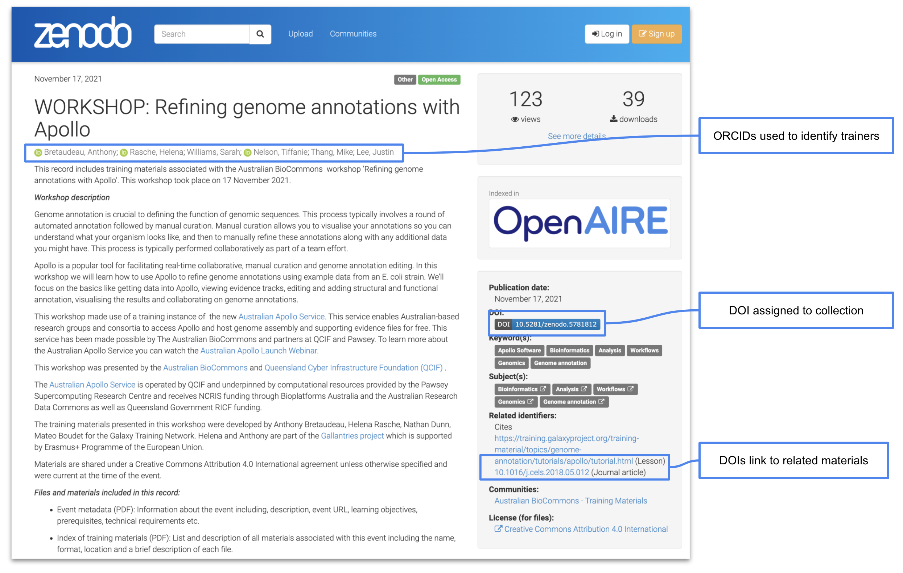
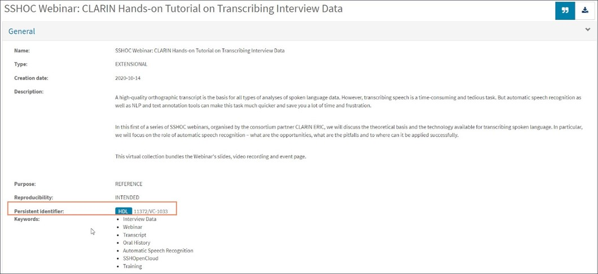
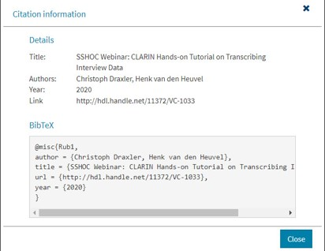
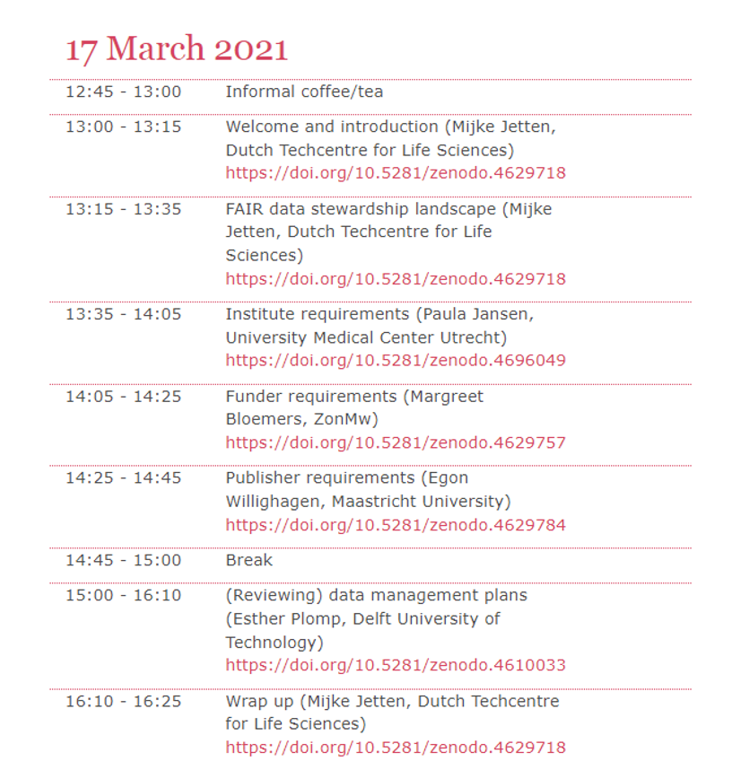
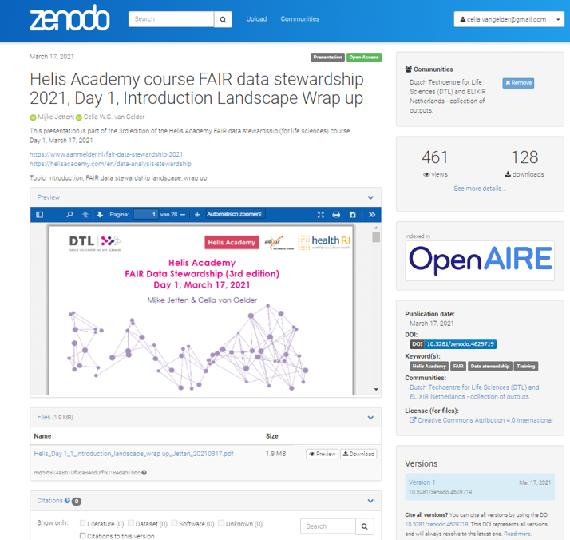

---
tags:
    - Unique identifier
    - ID
    - DOI
    - ORCID
    - PMID
    - Persistent identifier
---

## Description
In this chapter, we present what is a persistent identifier (PID), and how to get one for your training materials. This step is essential to achieve FAIR training materials, being directly linked with Findability and Reuse. 
As a consequence of getting a PID, visibility of your work can be enhanced, and the associated deposit works as a backup of your work by handing over the maintenance to the nominated repository.

!!! info "Learning outcomes"
    **At the end of this chapter you should be able to:**
   
    1. Explain what a PID is and its importance for enabling and sharing training resources in the context of FAIR and open education and training.
    2. List and differentiate the types of PIDs that are relevant for publishing and sharing training materials.
    3. Assign an appropriate PID to your training materials .
    4. Get an author ID ORCID

## Prerequisites
In order to decide whether the best choice for you is assigning each material its own identifier or organising a collection under one identifier you need to know the structure of your material, where it is best stored, as well as thinking about collaborators and potential readers. Therefore it can be useful to read the [Chapter 2- Structure materials for FAIRness](https://elixir-fair-training.github.io/FAIR-training-handbook/chapters/chapter_02/) and [Chapter 3- Getting ready to create your materials](https://elixir-fair-training.github.io/FAIR-training-handbook/chapters/chapter_03/).

## What is a Persistent Identifier (PID) and why should I use it for training materials?

Open science seeks to improve the sharing of a large body of knowledge on a wide scale.
To facilitate this, it is necessary that each element that will be shared can be easily and unambiguously identified and retrieved. The solution to this challenge is to assign each piece of information (training material, data, software, document, author etc.) a unique and permanent identifier (PID: Persistent Identifier).

_Imagine the following scenario_: if you go to the opera, you leave your coat in the cloakroom in exchange for a ticket. From that moment on, you don't have to worry about where your coat is stored. You enjoy the performance, knowing that your ticket allows you to get your coat back. This ticket carries a unique identifier (a number on the ticket) issued by a trusted third party (the wardrobe attendant) who makes sure that this number is unique and remains assigned to your coat.

As with the example about the coat, having a persistent identifier for training materials makes them easier to **find** amongst all the other materials in the same repository (i.e., the cloakroom). Furthermore, this facilitates a long-lasting material accessibility by working as backup. Additionally, using PIDs for the authors makes it easier to identify and acknowledge the contribution of individuals to developing and maintaining the materials. This also makes the materials easier to cite when it comes to **reusing** them.

**The PIDs must comply with a few rules:**

* **Globally unique:**

    To enable global uniqueness, a PID should comply with a **controlled syntax** to avoid clashes, for instance, by having **namespaces** that are **governed** by clearly defined **authorities**. (_the number of your ticket is unique, so you are sure you will get your coat back and not someone else’s_)

* **Persistent:** 

    The identifier, and the object to which it points, should be **maintained** for a **long period of time**. The syntax used for the identifier should be also persistent (don’t change the way you label your tickets; don’t dispose of the coat during the opera).

* **Resolvable**: 

    The identifier allows both **human** and **machine** users to **access the resource** (_the ticket tells you where to get your coat back_). 

By now you must be asking: in the context of training, when should I worry about the PIDs? Let me help you with that! For training materials, PIDs can be assigned to:

* Individual training materials (e.g., a set of slides, a training dataset)
* A collection of materials associated with a training event or topic
* Authors of the materials

In the following paragraphs we discuss how to get these PIDs for your training materials. Some real-word case studies provide a few examples of approaches to giving PIDs to your  training materials.

## Types of PIDs relevant for training materials

Although there are a number of different PID types that can be applied to objects and authors, the two which are most used for training materials are discussed here. These are DOIs and ORCID.

### What is a DOI? 

If you want to share your training material with the rest of the world, we recommend using a **Digital Object Identifier (DOI)** (doi.org). DOIs are one of the most common PIDs used by public repositories. If you would like to learn more about the concept of DOIs  take a look at this [fact sheet](https://www.doi.org/factsheets/DOIKeyFacts.html).
DOI stands for Digital Object Identifier, and it is a **unique** and **persistent** and permanent identification of  objects (physical or digital). And as they are coupled with metadata, they can be modified over time to keep track of the locations and characteristics of the objects they identify, both for you and your users. You benefit from efficient management and accurate tracking, as well as gaining the ability to more easily automate processes and collaborate with partners in your community. DOI relies on a non-profit organisation that is the governance body of the federation of registration agencies. DOIs are generated automatically when you make your resources available in a repository such as Dataverse and Zenodo, or when a research article is published.
   
### What is an ORCID?

ORCID, which stands for Open Researcher and Contributor ID, is a global, non-profit organisation which provides a **unique**, **persistent** identifier free of charge to researchers. You might be a lucky one that never had to worry about having a common name, but if you are not, you know how important it is to distinguish homonyms!  It is extremely useful to ensure that you are correctly identified, worldwide. ORCID is a perfect solution to take homonymy into account, what's more, the system allows you to add aliases on your profile to take care of any changes to your name making sure that it will be tracked back to you. Another good consequence, is that as your name and affilitations change your ORCID will stay the same, not just assuring that you get the credit you deserve, but also keeping track of your work.

You can see a bit more about it in the video below. 

<iframe src="https://player.vimeo.com/video/97150912?h=de3e7e4505" width="640" height="360" frameborder="0" allow="autoplay; fullscreen; picture-in-picture" allowfullscreen alt="Video: What is ORCID?" ></iframe>

<a href="https://vimeo.com/97150912">What is ORCID?</a> from <a href="https://vimeo.com/orcidvideos">ORCID</a> on <a href="https://vimeo.com">Vimeo</a>.

As you can see, PIDs for authors make it much easier to **FIND** materials written by a particular person, and also make it easier to ensure the credits for the right person. The Open Researcher and Contributor ID (ORCID) is increasingly used by journals and funders to uniquely identify individuals. It is already a requirement at the NIH (National Institutes of Health), CDC (Centers for Disease Control and Prevention), and more the 110 publishers. 
Therefore, it is a good option for authors of training materials as well.

#### Get yourself an ORCID  
Watch the video below to learn how to get your own ORCID.

<iframe src="https://player.vimeo.com/video/495762735?h=a7bc6b8ce7" width="640" height="360" frameborder="0" allow="autoplay; fullscreen; picture-in-picture" allowfullscreen alt="Video:A quick tour of the ORCID Record"></iframe>

<a href="https://vimeo.com/495762735">A Quick Tour of the ORCID Record</a> from <a href="https://vimeo.com/orcidvideos">ORCID</a> on <a href="https://vimeo.com">Vimeo</a>.

!!! example "Exercise"
    Learning experience: Read the case studies below to see some examples of how PIDs are used for training materials. Afterwards, think critically about your material and which case would fit your needs better. You can write down your ideas, create a schema, etc. 

!!! info
    
    Customised Persistent IDs, Pros & Cons:

    To be updated
    - What is it
    - How to do it
    - Pros & Cons

## How does it work in the real word: Case Studies of Using PIDs in Training

Before diving into how to assign PIDs to the training materials, we would like to show you two examples of how organisations are approaching this in practice. 

### 1. Australian BioCommons
[Australian BioCommons](https://www.biocommons.org.au/) supports Australian life science communities by providing bioinformatics and bioscience data infrastructures, services and training. At Australian Biocommons training materials from webinars and workshops are shared via a dedicated [Zenodo community](https://zenodo.org/communities/australianbiocommons-training/). The BioCommons chose to use Zenodo to share training materials because they don’t have a repository of our own and Zenodo has established ways of managing metadata, DOIs and versioning. It is also widely used in the scientific community.

For each event, a Zenodo record is created that includes detailed metadata, new training materials and links to previous materials that were reused as part of the training (Figure 1).

Two types of PIDs are used when sharing materials from our events.
* DOIs - Zenodo automatically assigns a DOI to the record for the event. DOIs are also used when linking to related materials to ensure that there is no ambiguity about which materials were used.
* ORCID - Trainers’ ORCIDs are used to ensure that they get credit for their efforts and to make it clear who participated in the event.

<figure>
    
</figure>

**Figure 1:** The Australian BioCommons collates materials from their events and shares them via Zenodo where they are assigned a DOI and authors are identified via their ORCIDs. [View this record on Zenodo.](https://zenodo.org/record/6350808#.YkPhE25Bw3Q)

### 2. CLARIN
[CLARIN](https://www.clarin.eu/) is a digital research infrastructure offering data, tools and services to support research based on language resources. Currently, the infrastructure does not have a centralised repository to store all the training and learning materials produced during the training events and workshops. 

A training event usually contains the following information: slides, handouts, video tutorials, language resources datasets and/or tools. The slides and handouts are frequently published on the event web page, while the recordings of the presentations are published on the CLARIN YouTube channel. On the other hand, the language resources and tools used during the training are stored in the CLARIN national repositories with a **unique** identifier, and can be cited.

One possible solution to have a PID assigned to all the materials used during one training event is to create a virtual collection in the CLARIN [Virtual Collection Registry](https://collections.clarin.eu/public?7). A virtual collection is a coherent set of links of digital objects that can be easily created, accessed and cited with the help of **DOIs**. The links can originate from different archives. Here is an example of a virtual collection created for a hands-on tutorial on transcribing interview data: http://hdl.handle.net/11372/VC-1033.

<figure>
    
</figure>
**Figure 2:** The CLARIN ...

<figure>
    
</figure>
**Figure 3:** The CLARIN ...

Other practices that the trainers in the CLARIN community have adopted are:
* Depositing the training materials together with the datasets in their CLARIN national data repository. See example: http://hdl.handle.net/20.500.11752/OPEN-537. The advantage of using this path is that the authors can add more extensive metadata to describe their materials.
* Depositing the training materials on Zenodo. See example: https://doi.org/10.5281/zenodo.5506969.  In this case, **related identifiers** have been included that lead to the main platform where the course has been developed and maintained.

### 3. Dutch Techcentre for Life Sciences 

The [Dutch Techcentre for Life Sciences](https://www.dtls.nl/) (DTL) - which also hosts ELIXIR-Netherlands - forms, together with its partners, a multidisciplinary platform for data-intensive research, with a focus on biological and molecular data handling: data generation, data stewardship, data infrastructure and data analysis. 

DTL has a [Zenodo community](https://zenodo.org/communities/dtl/?page=1&size=20) to upload presentations and course materials. We strongly believe in sharing our training materials and making them findable for re-use. We have chosen to give separate DOIs for individual, often topical, elements of a course. An example is our [Helis Academy FAIR Datastewardship Course](https://www.aanmelder.nl/fair-data-stewardship-2021), a course of 6 half days. 

Providing a separate DOI has the following advantages:
It is easier to mix and match different modules as part of a learning path, i.e. for the various target audiences a different combination of our training modules can be made, tailored for that specific purpose.
When updating or revising a single module it is more convenient to have that module as a separate entity with its own DOI, to easily keep track  of the versions of different modules.

At the level of the full course we have chosen to use ELIXIR TeSS as the registry and links to our training event details and training materials can be found in [this link](https://tess.elixir-europe.org/events/helis-course-fair-data-stewardship).

<figure>
    
</figure>
**Figure 4:** Example from the DTL Helis FAIR Data Stewardship Course with separate DOIs per topic. View [this page](https://www.aanmelder.nl/fair-data-stewardship-2021).

<figure>
    
</figure>
**Figure 5:** Zenodo record for the Introductory Module of the DTL FAIR Data Stewardship Course. View [this record](https://doi.org/10.5281/zenodo.4629718) on Zenodo.

## How to get a DOI for your training materials

Before getting a PID for your training materials you need to think how you want to organise your materials and how extensive your collection is. To help, ask yourself the following: 

_ | _ 
-- | --
OR |Do you want to get one PID for your whole training or course?
OR | If, for example, you have organised a one-week training or developed a MOOC course containing several topics, do you want to get a separate PID for each topic/module?
OR | You want to organise by concepts and create a mapped collection in which each concept will have an ID with dataset and metadata grouped

No answer is wrong, you just need to make sure that when you share the material all related data will be findable, accessible and reusable as much as possible. Keeping that in mind, you might want to find an strategy to help others reuse your training when the material is very extensive. For example, a full day or a full week training are composed not only of a presentation, but a description of sessions of this presentation, activities, videos, etc. So in this case, it could be handy to split the training into small sessions with individual PIDs, that can be packaged into a collection.

By far the easiest way to get a PID for your training materials is by sharing them in a public repository that assigns a PID on your behalf, see more about that in [RDMkit](https://rdmkit.elixir-europe.org/identifiers.html) and [Chapter 2](https://elixir-fair-training.github.io/FAIR-training-handbook/chapters/chapter_02/) and [Chapter 3](https://elixir-fair-training.github.io/FAIR-training-handbook/chapters/chapter_03/).

For example, in the case studies you read earlier, the Australian BioCommons shares materials via Zenodo which automatically assigns a DOI to the materials. Similarly, the CLARIN Virtual Collection Registry assigns a PID (either Handle or DOI) to materials added to a virtual collection. If you are sharing your materials via GitHub you also have the option to use Zenodo to archive your [repository on GitHub](https://docs.github.com/en/repositories/archiving-a-github-repository/referencing-and-citing-content) and issue a DOI for the archive. 

On the other hand, if you are maintaining your own repository of training materials, you will need to have a system in place for assigning and maintaining persistent identifiers. RDMkit provides guidance on the things you will need to consider when doing this.

!!! info "How to choose a repository"
    
     Need help choosing a repository for your materials? Have a look at this advice in Chapter X ?

!!! example "Exercise"

    Activity: Go to your favorite repository and check:
        a. Do they use DOI? 
        b. If not, what kind of identifier do they use? Is it a Persistent identifier?

## Evaluate yourself

Now you have completed the chapter, you should have reached the [learning outcomes](#learning-outcomes). Can you explain why PIDs are important for training materials? What is your plan for assigning PIDs to your own materials?

