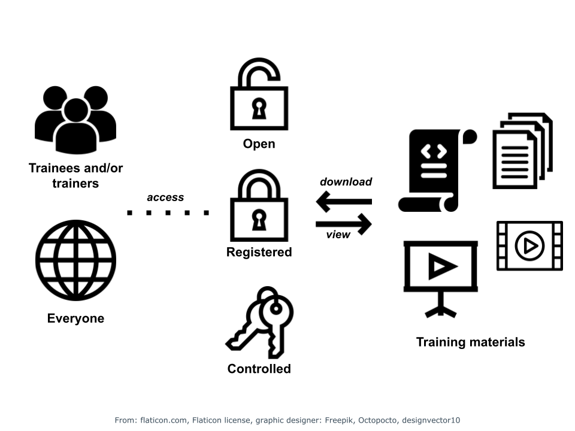

---
tags:
  - Accessibility
  - Accession rules
  - Authentification
  - Authorization
  - Inclusiveness 
---

**Contact person:**

- Helena Schnitzer [:custom-orcid:](https://orcid.org/0000-0002-6382-9452)
- Monique Zahn [:custom-orcid:](https://orcid.org/0000-0001-7961-6091)
- Hélène Chiapello [:custom-orcid:](https://orcid.org/0000-0001-5102-0632)
- Daniel Wibberg 
- Fred de Lamotte [:custom-orcid:](https://orcid.org/0000-0003-4234-1172)
- Helen Clare [:custom-orcid:](https://orcid.org/0000-0002-6656-3012)

## Description

This chapter explains how to make your training materials accessible, decide on the appropriate access rules, implement authentication and authorization to eventually limit the access, as well as the pros and cons of using repositories to share your training materials. We will provide guidelines for choosing a repository and making your materials accessible to as many people as possible (inclusive).

<figure>
  
    <figcaption>Figure 1: Different access levels</figcaption>
</figure>

!!! info "Learning outcomes"
    **At the end of this chapter you should be able to:**

    1. Define what accessible means in the context of FAIR 
    2. Explain the relevance of accessibility to FAIR Training Materials
    3. Explain the different levels of access
    4. Describe access requirements using clear language
    5. Choose the appropriate level of access for your training materials, including depositing your materials in a FAIR way
    6. Describe access to your materials using clear language
    7. Explain what is meant by accessibility for inclusiveness

## Prerequisites

You have a set of materials that you are considering making accessible and are familiar with the FAIR principles. It´s recommended to read [Chapter 1: Why FAIR training & training materials?](chapter_01.md) before starting on this chapter.

## Related chapters

* [Chapter 5: Give it a unique identifier](https://elixir-fair-training.github.io/FAIR-training-handbook/chapters/chapter_05/)  
* [Chapter 7: Make it reusable](https://elixir-fair-training.github.io/FAIR-training-handbook/chapters/chapter_07/) 
* [Chapter 9: Boosting discoverability](https://elixir-fair-training.github.io/FAIR-training-handbook/chapters/chapter_09/)

## Accessibility in the context of FAIR

Accessibility refers to the ability to retrieve content. Accessibility defines who, when, where (via a web site, a repository) and how (using a login, programmatically via an API, etc.) to access training materials. In your journey towards making your training materials FAIR [@Garcia2020], you will probably need to consider whether you need to restrict the accessibility to your training materials.

## Why is accessibility important

Training material which is accessible to trainees prior to a course lets them take a look and helps them to prepare for the course. During the course, it means all trainees benefit from training materials and participate in hands-on exercises. By allowing trainees to access the materials after the course, they can review it at their own pace, redo exercises, and consolidate their knowledge. By extending the accessibility of the materials to trainees who did not follow the course, you promote the opportunity of recruiting future trainees, and you may favour self-learning for people that weren’t able to attend a training session.

By making your training materials accessible to other trainers, you give them the opportunity to view the materials and possibly be inspired by them, or even to reuse them in their own courses (see Chapter 8 Licensing). Trainers who reuse your material may even provide feedback (possibling improving the materials) or even collaborating with you to develop further training materials.

Another incentive to making your training materials accessible is to point out the work you have done, for instance for funding bodies or hiring committees.

For trainers who have received public funding to create training materials, this provides a way to illustrate the use of the funds.

## How to access 

Ideally, data and training material should be accessible using standard protocols (http, api, etc.), as well as possibly using fully automated protocols (such as scrapers or crawlers).
Anyone with a computer and an internet connection should be able to obtain a description of the training materials and who to contact, without necessarily having access to the materials themselves. In other words, you should be able to view and (down)load the metadata (see [Chapter 4: Metadata & annotation](chapter_04.md)) without specialised tools. Therefore, a unique identifier (see [Chapter 5: Give it a unique identifier](chapter_05.md)) and the location (see [Chapter 9: Boosting discoverability](chapter_09.md)) where the training material is stored, are essential elements.

That said, access to training materials may be open or limited. Consider the following levels of access: 

1. **Open access**:  The training materials are shared publicly. Anyone can access the materials. 
2. **Registered access**: Anyone can access the materials provided they register beforehand and agree to the terms and conditions. 
3. **Controlled access**: Only specific persons can access the materials after requesting and being granted access. 

Depending on the repository you choose (see [Chapter 3: Getting ready to create your materials or reuse](chapter_03.md)), access to the material will differ. 

**Table 1 Access x Platforms**

| | Access level | Accessible to | Access Timeframe | Access from |
| --- | --- | --- | --- | --- |
| Google Suite | Open or controlled access  (editing, suggesting, viewing) | Anyone with the link or access rights  | Anytime | Web page |
| GitHub and GitLab | Open or controlled access  (editing, pull requests, viewing) | Anyone can view; access rights are required for pull requests and editing | Anytime | Web page, programmatic (API), Git|
| Zenodo | Open or controlled (restricted) access | Anyone (open access) or anyone with the approval of the depositor (restricted access) | Anytime provided there is no embargo | Web page, programmatic access (API) |
| LMSs (Coursera, Moodle) | Open, registered or controlled access | Anyone (open access), anyone registered (active account) or with access rights (restricted access) | Anytime provided the materials are not hidden | Web page |

##  Choosing the appropriate level of access

When considering the level of access that is appropriate, you should consider the setting in which the training materials are being used. The level of access will not be the same if the training materials you design are for a private company, if they are part of a university curriculum where the fees include access to the material or if they contain sensitive data, such patient information. In such cases, limiting the access is both needed and required.
Authentication and authorisation can be used to achieve this. This may require the help of the administrator of the learning management system or an IT for a web site. Restrictions can refer to a user account with user-specific rights, restricted domains (e.g., a university can give access to training material to their students), or paid options (content is only available for a fee).
As in a publication where all authors have to have read and agreed on the content, all authors should be consulted when evaluating the level of access. Institutions or funding bodies may also specify the level of access of any materials created, so you should consider this as well.
In the context of FAIR, training material does not have to be open exclusively. Even restricted data comply with the FAIR principles as long as accessibility requirements are defined properly.

!!! example "Exercise"
    Learning experience: Search for training material online and analyse how accessible it is and to whom. (in groups, 10 mins, 5 min search, 5 min wrap-up)

## Describing the access to your materials

By describing who can access your materials and how in a clear manner, you indicate to anyone wishing to access them how they can do so. You should clearly state the level of access as part of the metadata (see [Chapter 4: Metadata & annotation](chapter_04.md)). Obviously, you should also state the accessibility rules in plain English in the same location as your materials so that others know how to get access.

!!! note 
    If you are using an authentication system to restrict access or collect usage data, it is important to include data-protection information, either as part of the material documentation or the hosting website disclaimers.

Let’s see how this can be done. Have you ever come across course material in Zenodo tagged as Open access? This clearly indicates that there are no restrictions to access the materials. Or maybe a colleague has talked to you about a course available in coursera? As you will be asked to enrol before accessing the materials, access is restricted and limited to the time that the course is running.

## Accessibility for inclusiveness

Have you ever considered that your training material may not be understood by your trainees? Language may constitute a barrier to accessing learning material. This can be addressed by providing training materials in different languages, including metadata, in the same way that Wikipedia offers articles on the same topic in numerous languages” or the Carpentries [@data-carpentry] that so far provide lessons in different languages. 
You should also consider making your training materials accessible for those with specific needs [@ability-net]. For instance, someone with poor eyesight might appreciate the possibility of making text larger, whereas someone who is colour-blind might not interpret images the same way as someone who is not. You should consider consulting resources which provide colour-blind slide models or fonts suitable for people with dyslexia which improve reading comprehension and reading speed by making characters more distinct [@dyslexia-guide].

## Resources and References

\bibliography

   
