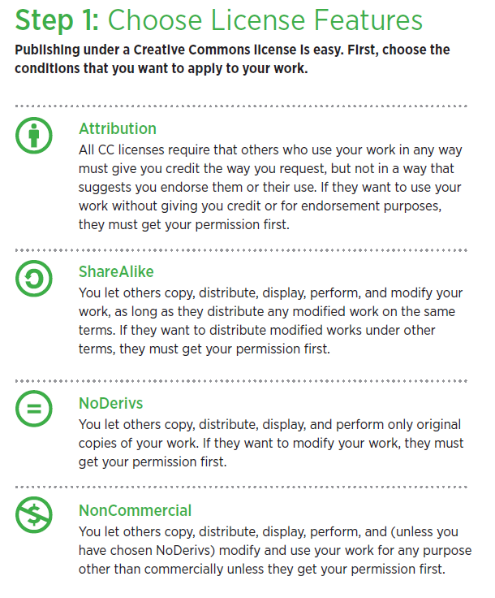
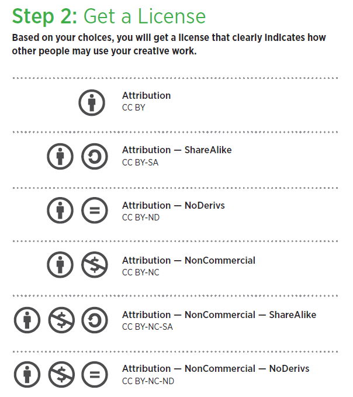

---
tags:
  - Licensing
  - Reusability
  - Accessibility
---

!!! Checklist  

    8.1 Clearly label your materials with the chosen licence
    
    8.2 Include your contact information in case anyone needs to ask you any questions about your materials or their use 
    
    8.3 Cite any other creators’ materials that you include in yours - do not reuse others’ works if you are not sure about their permissions 
    
    8.4 Check with your institute/company if there are any specific licence rules or guidance 

## Description

This chapter will explain how you can encourage use and reuse of training materials through choosing appropriate licences. It will cover the different licence options available to date and consider the implications for users. It will also explain the practicalities of implementing your chosen licences and give an awareness of common issues to consider. 

## Prerequisites

Learners should have material that they would like to share and consider attaching a licence to. 

## Learning Outcomes

1. List the differences between the various licence schemes and licence types
2. Describe the implications for users of materials and how this impacts on your choice

## What are licences and why are they required?

Licences are a standardised way of giving others specific permissions to use work you created. They allow you to put your work out publicly, while providing guidance to users about how they can use your materials and whether there are any restrictions. 

Licensing your materials implies that you own the intellectual property rights over them, and you will keep these rights through the licence. You can assign or transfer those rights to someone else (in particular, you should be aware of what the terms set by your institution are), but this is not done through licensing. In other terms, licensing allows the creators and detainer of Intellectual Property the right to profit from their work (in a broad sense) by controlling who uses their creations and how they use them. 

As discussed a few times now in previous chapters, making your training materials public, others can benefit from your work and experience. It also benefits you as it increases the possibility of your materials being used in the way you would like and in a way that provides you with credit for your work. By attaching a licence to your materials, you get to keep  control over how they can be used. For example, you may be happy for anyone to use your materials, provided you are credited, or perhaps you would like to allow anyone to use the materials, but only if they make no changes to them. Selecting the right licence allows you to make these choices and communicate them to your users.

It’s important to remember that not having a licence assigned does not mean that anyone is allowed to do anything with the material, but instead creates confusion around what is allowed.

## Licence schemes

There are many different licensing schemes available, each with different types of licences that allow you to choose what users of your materials can do with them. The different schemes were designed for different purposes (often, the type of items that the licence is applied to) and order of restrictiveness. 

Given the purpose of this handbook, this chapter will focus on licences that grant the possibility to use, modify or distribute the licenced items, the Open Source licences. Licences can also be used to deny these rights, but this choice would not be in line with FAIRification standards. The majority of the popular Open Source licences have been developed for software and code. Among them, the GNU General Public Licence, Mozilla Public License (MPL), Apache Licence and MIT Licence. 

One of the main distinctions is copyleft versus permissive licences. A Copyleft licence implies that the items derived from the original, licenced item inherit its licence terms. A permissive licence instead provides more freedom for the modification of the original terms. 

- The GNU General Public License (GPL) is the most restrictive among the licences here described. It preserves copyright terms and implies that any item deriving for the licensed item use must preserve the same GPL licence.
- The Mozilla Public License (MPL) is also a Copyleft licence, but allows modification and use of the original item in closed-source and proprietary items (software), as long as the MPL licensed items are kept in separate files and distributed with the derived items. 
- The Apache License requires licence notifications and copyrights on the distributed items. However, derivative works, larger projects, or modifications are allowed to carry different licensing terms when distributed and are not required to provide source code. Hence, it is a permissive licence. 
- The MIT License is also a permissive licence, and among those described is the one written in simplest terms. It allows modification, re-use, etc. of the licensed item as long as the original copyright and licence notice is retained in any copy of the source.[@open-source-licenses]

Each of these licence schema includes many variations. All of the examples above are licences that were originally developed for code and software, so some aspects of them might be sub-optimal for training materials. The most common type of licence used for training materials is instead Creative Commons (CC) and we’ll discuss this further later on in this chapter. Creative Commons was developed to address the issues of sharing original, creative work in the digital world, considering the vast and easy sharing capabilities made possible by current technology. While software-specific licences are focused on the usage of the item as a component of a larger or deriving project, as code often is, CC licences are focused on retaining the Intellectual Property Rights yet allowing the sharing of the items, hence supporting a wider distribution of the intellectual output. For this reason, CC licences are the most used on training materials. However, while this choice simplifies the protection of the creative/intellectual work put into training materials development, it makesthe means for (re-)use of parts of it less straightforward (e.g. single slides). CC licences still retain a wide variation of terms, including some types which are more similar to the Copyleft and others which are more similar to the permissive licences. 

Your choice of scheme and licence will depend on a number of factors, such as the type of materials, who the materials are targeted at, what you anticipate users wanting your materials for, any rules your institute may have already, and any materials you include within yours. 

!!! example "Learning activity: find some examples of licences on training materials"

    This learning activity will help you think more critically about how licences can be used.

    1. Find three examples of training materials that include a licence
    2. Do they all use the same licence scheme or type of licence? 
    3. Are you clear on how you can use the materials or do you require more information?
    4. Were the licences easy to spot?

## Creative Commons licences

There are four conditions which can be applied to your materials by Creative Commons licences [@creative_commons_2022]:

<figure>
  
    <figcaption>Image from https://wiki.creativecommons.org/images/6/6d/6licenses-flat.pdf. The image is in the public domain, <a href="https://creativecommons.org/share-your-work/public-domain/cc0">CC0</a>. </figcaption>
</figure>

These four conditions can be combined to make up six different types of Creative Commons licences for you to choose for your materials:

<figure>
  
  <figcaption>Image from https://wiki.creativecommons.org/images/6/6d/6licenses-flat.pdf. The image is in the public domain, <a href="https://creativecommons.org/share-your-work/public-domain/cc0">CC0</a>. </figcaption>
</figure>

You can label your materials with the above logos to help users quickly know which licence you have applied to your materials. Logo images are available for download from Creative Commons. 

There is also the option to use CC0 which allows you to put materials in the public domain, meaning users can do whatever they like with the materials, with no conditions attached. 

Before adding a licence to your training materials, it is important to keep in mind that licences cannot be revoked. The materials will remain covered by the licence you chose, even if you decide to stop distributing the materials later on.

!!! example "Learning activity: choosing a licence"

    To help you decide which licence is most suitable for your materials, Creative Commons provides a licence chooser. In the following activity, you will try out the <a href="https://creativecommons.org/choose/">Creative Commons licence chooser</a> for yourself.

    1. Select some of your training materials that you would like to add a licence to.
    2. Try the Creative Commons Licence Chooser to determine which licence is most suitable for your selected materials.
    3. Consider the licence the Chooser identified, do you think it is suitable for your materials? Remember, you may also need to consider requirements and restrictions set by your institute or company.

## Attaching a licence to your materials

Once you have chosen a licence for your materials, you need to ensure you communicate that licence to all users of your materials. 

Logos and images that illustrate the chosen licence can be a great way of adding the licence to your materials. But to make sure all users understand what the licence means, you should add a link to the page that details the licence where possible. For example, if you use a CC-BY licence, link to the relevant page on the Creative Commons website.

## Reusing licenced materials

If you wish to reuse someone else’s materials you must first check that the licence they have applied to them allows it. You will also need to ensure that you recognise and cite their work appropriately (<a href="https://elixir-fair-training.github.io/FAIR-training-handbook/chapters/chapter_10/">see Chapter 10</a>).

The licence that you can apply to the new version of the materials depends on the original licence and how you have changed, adapted or remixed the materials. Creative Commons provides a <a href="https://certificates.creativecommons.org/cccertedu/chapter/4-4-remixing-cc-licensed-work/">guide on how to do this in different situations</a>.

## Next steps

Choosing an appropriate licence is an important step in encouraging appropriate recognition of your work and encouraging contributions and collaborations. Read more about recognition and contributions to training materials in <a href="https://elixir-fair-training.github.io/FAIR-training-handbook/chapters/chapter_10/">Chapter 10</a>.

\bibliography

___________________________________________

Please give us your feedback, we are always working on improving this book to attend the needs of its users. When writing your feedback please add the chapter number or name. Thank you. 