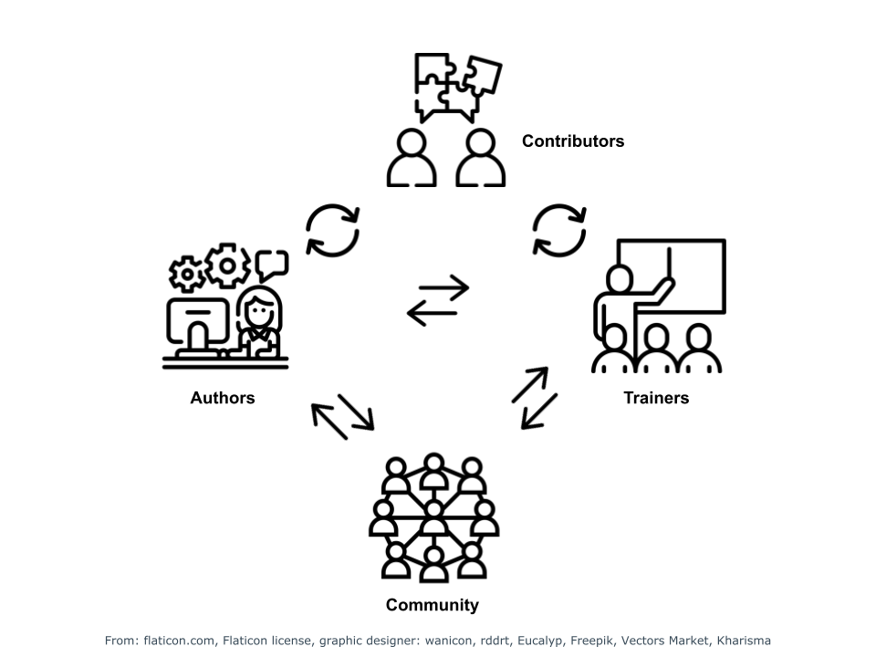

---
tags:
    - Recognition
    - Acknowledgement
    - Authorship
    - Citation
    - Attribution
---

## Description

This chapter will explain why it is important to add attributions to your training material. We will define the roles of author, trainers and contributor and ways of how to attribute credit to them in the contact of training material. It will also discuss of how you can encourage others to contribute to your material. 

!!! info "Learning outcomes"
    **At the end of this chapter you should be able to:**

    1. Recognise the importance of attribution and citations
    2. Explain why it is important to encourage continuous contributions and acknowledgements
    3. Define the difference between author, trainer and contributor 
    4. Define criteria for acknowledgements
    5. Define author/contributor roles based on the Contributor Roles Taxonomy (CRediT) matrix
    6. Describe ways to engage communities (trainers and trainees) to get contributions and feedback
    7. Use persistent identifiers for people in the context of attribution
    8. Describe how to capture contributors and authors depending on the repository / platform
    9. Provide credit for other training material

## Prerequisites

- Know what an ORCiD is. More information in [chapter 5](chapter_05.md)
- Know the different file formats and tools that are around to develop, store and share training materials. More information in [chapter 1](chapter_01.md) and [chapter 2](chapter_02.md)

## Importance of attribution of credit

Attributing credit is as important for training material as it is for scientific literature. While in the scientific literature authors and co-authors are listed, the following roles play an important part in the context of training material.

* Author
* Teacher / trainer
* Contributor

In addition to this, there may also be a need to consider the funder(s) and organisation or community that enabled the development of the materials. We will define these roles in more detail in the next section and also clarify how credit is attributed for each of them. Attributing credit to these roles makes them (most often scientists) more visible, serves as a proof of their effort beyond pure research and can bring these scientists additional recognition. In addition, it clarifies the responsibilities of those who contributed to certain content of the training material and the training session and thus allows trainers who will re-use the training material to contact these people with potential follow-up questions. It makes those who contributed to the material personally accountable for their contributions. Beyond the individual author, Teacher/trainer and contributor, the funder(s), developing organisation or community play a role in the longer term maintenance of the materials. In the end, attributing contact creates a community of trainers and contributors, which not only makes your course material better, but it's also a great way together. 

All of the different roles are related to each other. The author(s) initiate and generate the material, and the trainer interacts with the learners. Contributors interact with the authors and trainers in order to improve the material. The community provides existing material and knowledge where the trainer, author and contributor can rely on, while at the same time the community profits from the generated material. Below there's figure representing these relationhips. 

<figure>
  
    <figcaption>Different roles and their relationships</figcaption>
</figure>

!!! example "Exercise"
    Learning experience: Search for training material online and analyse how credit is attributed and to whom. (in groups, 10 mins, 5 min search, 5 min wrap-up)

## Different roles 

The three different roles have different characteristics that you can use to define them.

Each **author** is expected to:

- Have made substantial contributions in the capacity of one of the roles in the [credit matrix](#credit-matrix)
- Have approved the course version
- Be personally accountable for their contributions

Each **teacher / trainer** is expected to have had interactions with learners during the respective course version as part of a didactic process.

Each **contributor** has contributed to the course material including, but not limited to:

- Improvement of exercises and lectures
- Testing and evaluation of exercises/lectures/learner’s environment

## Using material of others

Everyone who does not meet authorship, contributor or trainer criteria but deserves so should be acknowledged. For example, persons or organisations should be **cited** if their course material was used as inspiration for the current course material version. The amount of acknowledgment for a piece of training materials is dependent on the amount of reuse of those materials. Sources used for teaching or training materials should, at minimum, follow academic guidelines for citation. This level of acknowledgment is appropriate in the case when a relatively small amount of materials are being used from a source in the context of other developed work. 

!!! note 
    Minimum information for citations: 
    Author, year, material title, version, DOI

When you are citing/referencing training materials, try to follow the academic citations/reference style that you use for citing literature. To eliminate name confusion and ensure appropriate attribution to the authors and teachers, it is highly recommended to adopt [ORCID iDs](https://orcid.org/).

 Remember to cite "invisible" training materials as well - e.g. quizzes, literature lists, etc.  In the case where individual figures or tables are taken from a source then should be cited as and when the figure or table appears. At the other end of the spectrum, whole-scale reuse of materials, e.g. the content of an entire lecture or web-site should maintain the overall original appearance of the materials. This includes keeping any logos and branding on materials and footnotes or headers that identify the authors. 

A **funder** has provided financial support for the development of the materials. An organisation or community has coordinated the development of the materials and has undertaken to develop the materials in the longer term. If the materials have been explicitly developed with support from a grant then the grant code should also be quoted.

In the table below you will find an overview of how and where you can specify different roles and citation in training materials. 

*Table 1. Guidance on where to specify the different roles/citations*

| Type of material        	| Author                                                                                                      	| Trainer                                                                                                        	| Contributor                                                                                                                    	| Citations                                                                                                                                                    	|
|-------------------------	|-------------------------------------------------------------------------------------------------------------	|----------------------------------------------------------------------------------------------------------------	|--------------------------------------------------------------------------------------------------------------------------------	|--------------------------------------------------------------------------------------------------------------------------------------------------------------	|
| slides                  	| On the first slide of a slide deck, if possible   including ORCiD as well                                   	| Often identical with the author, if not also   listed on the first page of the slide deck                      	| In the acknowledgement slide or anywhere else   where appropriate                                                              	| On specific slide, including a DOI if possible                                                                                                               	|
| datasets                	| In metadata and README.md in a repository, e.g.   Zenodo, including ORCiD as well                           	| In metadata and README.md in a repository, e.g.   Zenodo, including ORCiD as well                              	| In metadata and README.md in a repository, e.g.   Zenodo, including ORCiD as well                                              	| In metadata and README.md in a repository, e.g.   Zenodo, including DOIs and ORCiD as well                                                                   	|
| documents               	| On the first/cover page, including ORCiD                                                                    	| Often identical with the author, if not also   listed on the first page                                        	| In the acknowledgement section or anywhere else   where appropriate                                                            	| On specific page,  including a DOI if   possible                                                                                                             	|
| websites or  webpages   	| On the course website main page, including ORCiD                                                            	| On the course website main page, including ORCiD                                                               	| At the appropriate course page or in the   acknowledgements                                                                    	| At the course website main page for general   acknowledgement (e.g. 'this course was inspired by ...') and at the appropriate   course pages, including a DOI  	|
| github/other repository 	| In   the README.md/metadata in the github/other repository and .zenodo.json file                            	| Often   identical with the author, if not listed in the README.md/metadata                                     	| As   an automatic contributor of the github repository                                                                         	| In   the README.md                                                                                                                                           	|
| video - lectures        	| In the description on the page where a recording   is made available; also on the Intro page of the video.  	| Often identical with the author, if not also   listed in the description, also on the Intro page of the video  	| In the acknowledgement or anywhere else where   appropriate. Quite often videos include logos of organizations and   funders.  	| In the extended description if possible                                                                                                                      	|
| software                	| In the README.md/metadata in the github/other   repository and .zenodo.json file                            	| Often identical with the author, if not listed   in the README.md/metadata                                     	| As an automatic contributor of the github   repository                                                                         	| In [.cff files](https://citation-file-format.github.io/cff-initializer-javascript/#/)                                                                                                                                             	|

### Get cited!

When you are creating training materials, provide guidelines on how to cite them and credit the authors and other contributors. If you are using a git repository, you can for example add it to a [`CITATION.cff` file](https://docs.github.com/en/repositories/managing-your-repositorys-settings-and-features/customizing-your-repository/about-citation-files). An easy way to get a DOI and therefore a way to be cited is by registering your material to [zenodo](https://zenodo.org/). 

## Importance to encourage contribution

It is important to encourage contribution to training material as this will allow for the training content to develop over time, and thus to be kept updated. In addition potential mistakes can be identified and corrected, thus the quality of the material will increase with more contributions. Acknowledging contributions serves as a motivation for people to provide input and will drive the formation of a community of interest.

A first step in encouraging contributions would be creating a warm environment for people that are interested to work on your material. You can do that by encouraging people you that might be interested, but also online, by writing encouragements associated with your material, and provide instructions on how to contribute. In a git repository, this is typically done in a file called `CONTRIBUTING.md`. 
 
## Credit matrix

It is more and more common in scientific literature to use a matrix for clarifying contributions to a publication. Such a matrix provides a standardised list of contributor roles and allows to assign authors to these roles. One example of such a matrix is the [CRediT matrix](https://credit.niso.org/). The CRediT matrix was reworked for the purpose of training material and is provided below. It should become best practice to use such a matrix also for training materials.

The CRediT matrix can be helpful in evaluating whether a person is an author or contributor. Usually an author has made a significant contribution to one or more roles in the CRediT matrix. Related to this, it can be used to describe the actual responsibilities of the different authors. 

| CRediT role                                                                       	            | Relevance training                                                             	| Interpretation in training context                                                                                                                   	|
|-----------------------------------------------------------------------------------------------	|--------------------------------------------------------------------------------	|------------------------------------------------------------------------------------------------------------------------------------------------------	|
| [Conceptualization](https://credit.niso.org/contributor-roles/conceptualization/)         	    |  Yes                                                                           	| Concept of the course/session. E.g. defining the need                                                                                                	|
| [Data curation](https://credit.niso.org/contributor-roles/data-curation/)                 	    |  Yes, where relevant                                                           	| Prepare and maintain course data (including software code, where it is necessary for interpreting the data itself) for initial use and later re-use. 	|
| [Formal Analysis](https://credit.niso.org/contributor-roles/formal-analysis/)            	        | Have considered it but we think it might not be relevant for training material 	|                                                                                                                                                      	|
| [Funding acquisition](https://credit.niso.org/contributor-roles/funding-acquisition/)        	    |  Yes                                                                           	| Acquisition of funds for the course                                                                                                                  	|
| [Investigation](https://credit.niso.org/contributor-roles/investigation/)              	        |  Have considered it but we think it might not be relevant for training materia 	|                                                                                                                                                      	|
| (Training) [Methodology](https://credit.niso.org/contributor-roles/methodology/)     	            |  Yes                                                                           	| Defining course format/exercise ideas.                                                                                                               	|
| [Project administration](https://credit.niso.org/contributor-roles/project-administration/)     	|  Yes                                                                           	| Management and coordination                                                                                                                          	|
| [Resources](https://credit.niso.org/contributor-roles/resources/)                  	            |  Yes                                                                           	| E.g. computing resources                                                                                                                             	|
| [Software](https://credit.niso.org/contributor-roles/software/)                   	            |  Yes                                                                           	| Software and code required for exercises and/or generation of course material                                                                        	|
| [Supervision](https://credit.niso.org/contributor-roles/supervision/)                	            |  Yes, where relevant                                                           	|  Leadership responsibilities for the course                                                                                                          	|
| [Validation](https://credit.niso.org/contributor-roles/validation/)                 	            |  Yes, where relevant                                                           	|  Verification of the overall reproducibility/reusability of course material                                                                          	|
| [Visualization](https://credit.niso.org/contributor-roles/visualization/)              	        |  Yes                                                                           	|  Creation of visual work for the purpose of teaching.                                                                                                	|
| [Writing - original draft](https://credit.niso.org/contributor-roles/writing-original-draft/)   	|  Yes                                                                           	|  Actual generation of final course material                                                                                                          	|
| [Writing - review & editing](https://credit.niso.org/contributor-roles/writing-review-editing/) 	|  Yes                                                                           	|  Evaluation and testing of course material                                                                                                           	|

!!! example "Learning experience"
    How useful do you think the matrix is and which roles still need to be adapted for training material?

    OR: Use the provided credit matrix and apply it to your training material.

## Evaluate yourself

Now you have completed the chapter, you should have reached the [learning outcomes](#learning-outcomes). Scroll up, and see whether you managed. 
